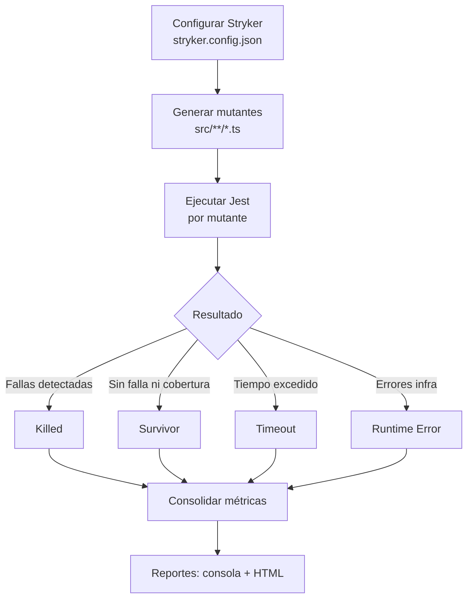
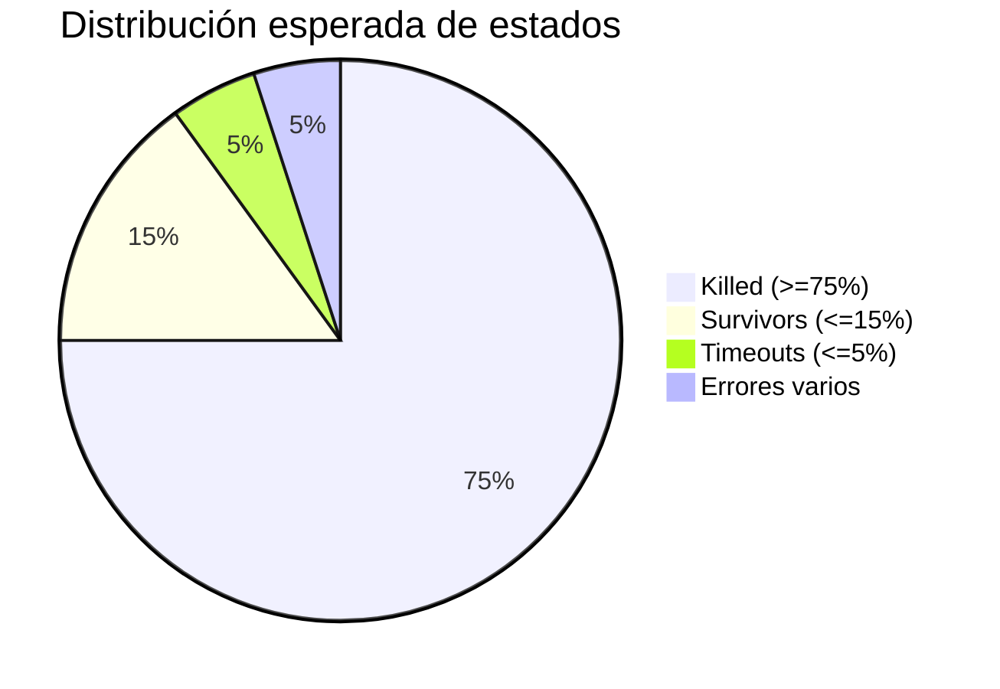
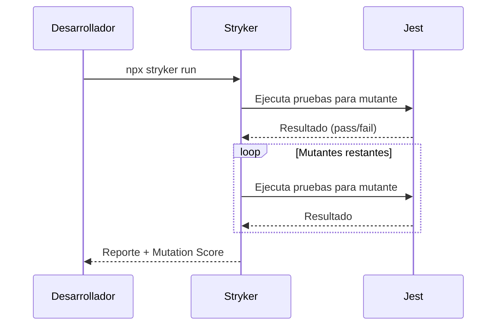

# Guía de Mutation Testing

Esta guía resume cómo el proyecto aplica *mutation testing* con Stryker, qué resultados esperar y cómo interpretar los reportes. Está pensada para cualquier persona que ejecute `npx stryker run` y necesite entender el valor del proceso.

## Conceptos clave
- `Mutante`: versión del código con una modificación mínima e intencional para comprobar si las pruebas detectan el cambio.
- `Sobreviviente`: mutante que no es detectado por las pruebas (indica un hueco en la cobertura o aserciones débiles).
- `Mutation Score`: porcentaje de mutantes eliminados. Se calcula como `(Mutantes - Sobrevivientes) / Mutantes * 100`.
- `Killed`, `Timeout`, `No Coverage`: etiquetas que usa Stryker en el reporte HTML para clasificar el estado final de cada mutante.

## Flujo del proceso

### Expectativas de ejecución
- Tiempo: proporcional a la cantidad de mutantes. Para `src/**/*.ts` suele multiplicar por 10‑15 el tiempo del suite Jest.
- Recursos: requiere CPU elevada. Ejecutar en entornos locales con al menos 4 cores o CI con agentes dedicados.
- Reportes: Stryker genera salida en consola (`progress`, `clear-text`) y un reporte HTML en `.stryker-reports/mutation/html`.

## Métricas y umbrales recomendados

- Objetivo mínimo: `Mutation Score ≥ 70%` para aceptar una rama. Ideal: `≥ 85%`.
- Aumentos de `Survivors` indican pruebas débiles; agrega casos centrados en el comportamiento específico.
- `Timeout` altos suelen señalar pruebas lentas o dependientes de IO; optimiza o usa *test doubles*.

## Interpretación de resultados
1. Revisa el `clear-text report`: ahí se listan los archivos con peor `Mutation Score`. Prioriza los que tengan mayor cantidad de sobrevivientes.
2. Abre el reporte HTML y localiza cada mutante sobreviviente. El panel lateral muestra la mutación aplicada y la línea exacta.
3. Decide la acción:
   - Falta de cobertura: crea una prueba nueva que ejecute la rama mutada.
   - Aserción débil: refuerza la expectativa para cubrir el cambio.
   - Código muerto: elimina o refactoriza.

## Buenas prácticas
- Mantén separado el conjunto de archivos a mutar (`mutate` en `stryker.config.json`) para excluir tipados o pruebas (`!src/**/*.test.ts`).
- Habilita `coverageAnalysis: perTest` (ya activo) para reducir ejecuciones redundantes.
- Corre primero `npm test` para asegurar que el suite base pasa; Stryker no puede trabajar sobre pruebas rotas.
- Automatiza en CI, pero permite ejecutar localmente antes de abrir PRs.
- Documenta excepciones: si decides ignorar un sobreviviente, anota la razón y plan de mitigación.

## Próximos pasos sugeridos
1. Ejecuta `npx stryker run` tras cambios significativos de lógica.
2. Introduce mutantes manuales en áreas críticas para validar hipótesis antes de escalar a toda la base.
3. Ajusta los umbrales (`thresholds`) en `stryker.config.json` para fallar la ejecución cuando el `Mutation Score` caiga por debajo del mínimo aceptable.

Con esta guía, cualquier miembro del equipo puede entender qué esperar del mutation testing y cómo actuar frente a los resultados.
