# Cómo funciona Stryker Mutator

Este documento detalla el funcionamiento interno de Stryker y cómo se configura en un proyecto de Node.js/TypeScript.

## 1. El ciclo de vida de Stryker

Stryker opera en fases secuenciales para evaluar la robustez de tus pruebas. Todo este proceso ocurre sin modificar tu código fuente original.

```mermaid
sequenceDiagram
    autonumber
    participant Dev as Desarrollador
    participant Stryker as Stryker (Orquestador)
    participant Mutator as Generador de Mutantes
    participant Runner as Ejecutor de Tests (Jest)
    participant Report as Reporteador

    Dev->>Stryker: npx stryker run
    Note over Stryker: Fase 1: Análisis y Configuración
    Stryker->>Stryker: Lee stryker.config.json
    Stryker->>Runner: Ejecuta pruebas originales (Dry Run)
    Runner-->>Stryker: ✅ Pruebas pasan (Cobertura 100%)
    
    Note over Stryker: Fase 2: Generación de Mutantes
    Stryker->>Mutator: Analiza código fuente (src/**/*.ts)
    Mutator->>Mutator: Crea copias en memoria
    Mutator->>Mutator: Aplica mutaciones (e.g., + por -)
    Mutator-->>Stryker: Lista de N mutantes generados

    Note over Stryker: Fase 3: Ejecución de Pruebas (Mutation Run)
    loop Por cada Mutante
        Stryker->>Runner: Inyecta código mutado (Sandbox)
        Stryker->>Runner: Ejecuta SOLO tests relacionados
        alt Test Falla ❌
            Runner-->>Stryker: Mutante MUERTO (Killed) 🏆
        else Test Pasa ✅
            Runner-->>Stryker: Mutante VIVO (Survivor) 💀
        else Timeout ⏱️
            Runner-->>Stryker: Mutante TIMEOUT (Timeout)
        end
    end

    Note over Stryker: Fase 4: Reporte
    Stryker->>Report: Calcula Mutation Score
    Report-->>Dev: Genera HTML, JSON y consola
```



### Explicación de las fases

1.  **Dry Run (Prueba en seco):** Stryker corre tus tests tal cual están. Si fallan antes de empezar, se detiene. Necesita una base verde.
2.  **Generación:** Identifica qué partes del código pueden cambiarse (operadores lógicos, matemáticos, valores de retorno, etc.).
3.  **Ejecución (Sandbox):** Por cada mutante, crea un entorno aislado y corre los tests. Si usas `coverageAnalysis: perTest`, solo corre los tests que tocan la línea mutada, ahorrando mucho tiempo.
4.  **Cálculo:** El *Mutation Score* es `(Killed + Timeout) / Total Mutantes * 100`.

## 2. Tipos de Mutadores Comunes

Stryker incluye varios "mutadores" estándar. Aquí algunos ejemplos de qué cambios hace automáticamente:


## 3. Configuración (`stryker.config.json`)

El archivo de configuración le dice a Stryker qué archivos mutar, qué runner usar y dónde guardar los reportes.

```json
{
  "$schema": "./node_modules/@stryker-mutator/core/schema/stryker-schema.json",
  "mutate": [
    "src/**/*.ts",          // 1. Archivos a mutar
    "!src/**/*.test.ts",    // 2. Excluir tests
    "!src/types.ts"         // 3. Excluir interfaces/tipos (no se pueden mutar)
  ],
  "testRunner": "jest",     // 4. Runner de pruebas
  "jest": {
    "projectType": "custom",
    "configFile": "jest.config.js",
    "enableFindRelatedTests": true // Optimización clave
  },
  "reporters": [
    "progress",             // Barra de progreso en consola
    "clear-text",           // Resumen en texto al final
    "html"                  // Reporte interactivo web
  ],
  "coverageAnalysis": "perTest", // "all", "perTest", "off". perTest es lo más rápido.
  "checkers": ["typescript"],    // Verifica que el mutante compile antes de testearlo
  "tsconfigFile": "tsconfig.json"
}
```

### Desglose de opciones clave

*   **mutate:** Define el alcance. Es crucial excluir archivos de prueba y definiciones de tipos, ya que mutarlos suele dar falsos positivos o errores de compilación.
*   **testRunner:** Stryker soporta Jest, Karma, Mocha, etc. Aquí usamos Jest.
*   **coverageAnalysis:**
    *   `off`: Corre TODOS los tests para CADA mutante. (Lentísimo)
    *   `all`: Corre todos los tests, pero mide cobertura primero.
    *   `perTest`: Corre solo los tests que cubren la línea mutada. (Recomendado)
*   **checkers**: El `typescript` checker es vital en proyectos TS. Si Stryker genera un mutante que no compila (ej: `return "string"` en una función que retorna `number`), lo descarta inmediatamente como "Compile Error" y no pierde tiempo corriendo tests.

## 4. Estructura de Carpetas Generada

Al finalizar, Stryker crea una carpeta `.stryker-tmp` (temporal) y los reportes configurados.

```mermaid
graph LR
    A[Raíz del Proyecto] --> B[src/]
    A --> C[test/]
    A --> D[reports/]
    D --> E[mutation/]
    E --> F[html/index.html]
    E --> G[mutation.json]
    A --> H[.stryker-tmp/]
    H --> I[sandbox-123/]
    I --> J[Copia del código mutado]
```



El archivo `reports/mutation/html/index.html` es el entregable más valioso. Ábrelo en tu navegador para ver línea por línea qué sobrevivió.
