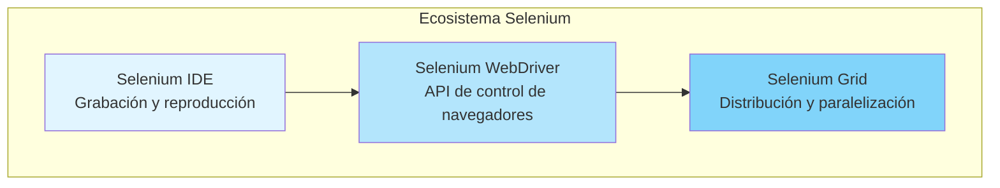
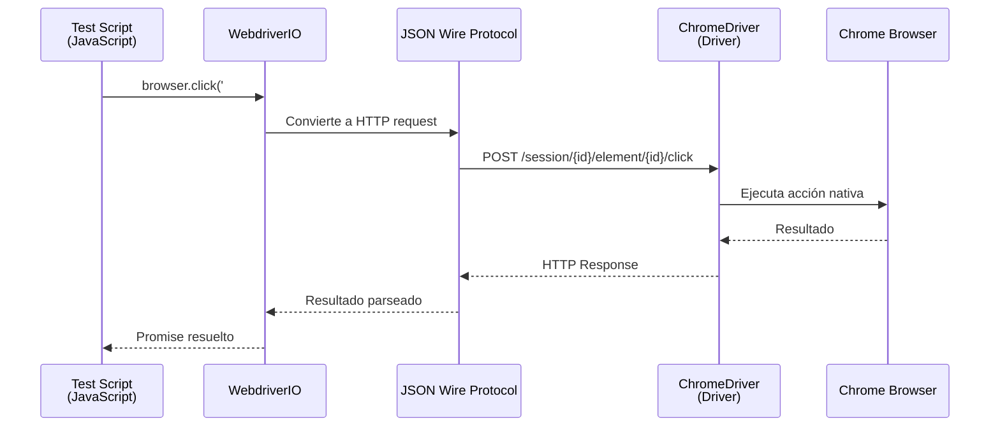
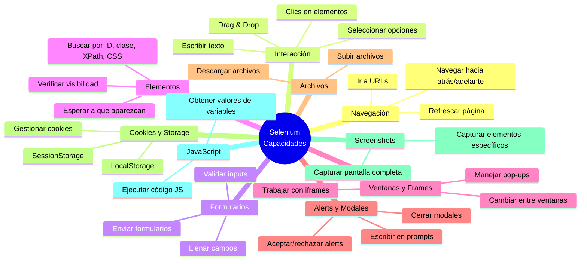
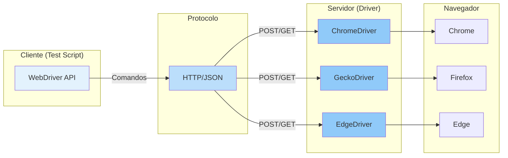
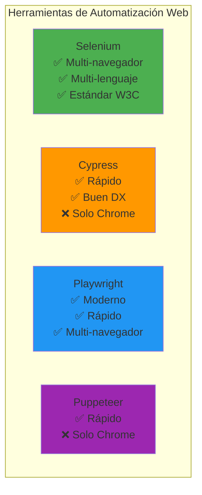

# ¿Qué es Selenium?

## Introducción

**Selenium** es un framework open-source para automatizar pruebas de aplicaciones web. Permite controlar navegadores de forma programática, simulando las acciones de un usuario real (clic, escritura, navegación, etc.).

## Componentes de Selenium

### 1. Selenium IDE
- Extensión de navegador para grabar y reproducir acciones
- Útil para prototipos rápidos
- No requiere programación

### 2. Selenium WebDriver
- **Componente principal** que usamos en este proyecto
- API para controlar navegadores desde código
- Soporta múltiples lenguajes (Java, Python, JavaScript, C#, Ruby, etc.)
- Comunicación directa con el navegador mediante protocolo W3C WebDriver

### 3. Selenium Grid
- Permite ejecutar pruebas en múltiples máquinas y navegadores
- Útil para pruebas paralelas y cross-browser
- Escalable para entornos CI/CD

## Arquitectura de Selenium WebDriver

## Capacidades de Selenium

### ✅ Lo que Selenium PUEDE hacer

### ❌ Lo que Selenium NO puede hacer

- **Aplicaciones de escritorio nativas** (solo web)
- **CAPTCHAs** (requieren intervención humana)
- **Pruebas de rendimiento** (usar herramientas especializadas)
- **Pruebas visuales avanzadas** (usar herramientas como Percy, Applitools)

## Protocolo WebDriver (W3C)

Selenium usa el protocolo estándar W3C WebDriver para comunicarse con los navegadores:

## Ventajas de Selenium

1. **Multi-navegador**: Chrome, Firefox, Edge, Safari
2. **Multi-lenguaje**: Java, Python, JavaScript, C#, Ruby, etc.
3. **Multi-plataforma**: Windows, macOS, Linux
4. **Open-source**: Gratuito y con gran comunidad
5. **Estándar W3C**: Protocolo oficial y bien documentado
6. **Extensible**: Integración con frameworks de testing

## Limitaciones

1. **Solo aplicaciones web**: No funciona con apps de escritorio o móviles nativas
2. **Dependiente de la UI**: Si cambia la interfaz, las pruebas pueden romperse
3. **Lento**: Más lento que pruebas unitarias o de API
4. **Mantenimiento**: Requiere actualizar selectores cuando cambia la UI
5. **No resuelve CAPTCHAs**: Requiere intervención manual

## Selenium vs Otras Herramientas

## En este Proyecto

Este proyecto utiliza **WebdriverIO** como wrapper de Selenium WebDriver, que proporciona:

- API más moderna y fácil de usar
- Gestión automática de drivers
- Integración con frameworks de testing (Mocha, Jest, etc.)
- Mejor manejo de async/await
- Utilidades adicionales (screenshots, reportes, etc.)
