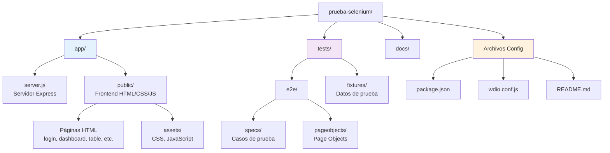
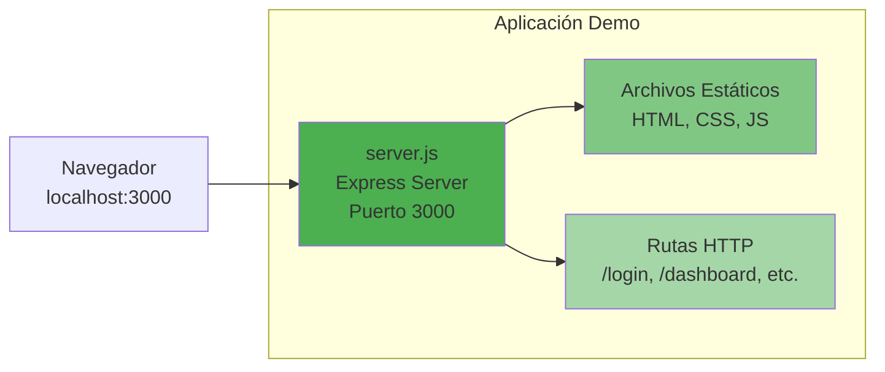
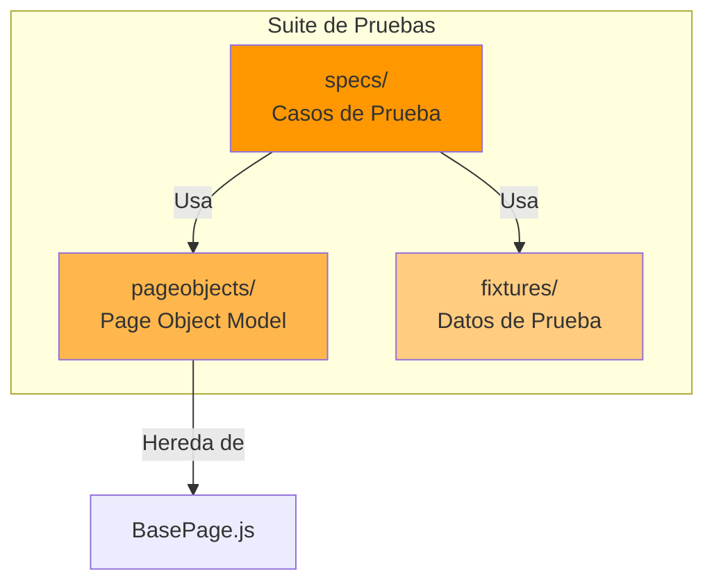
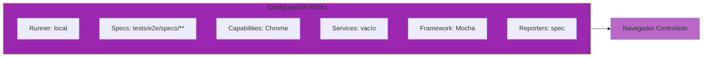
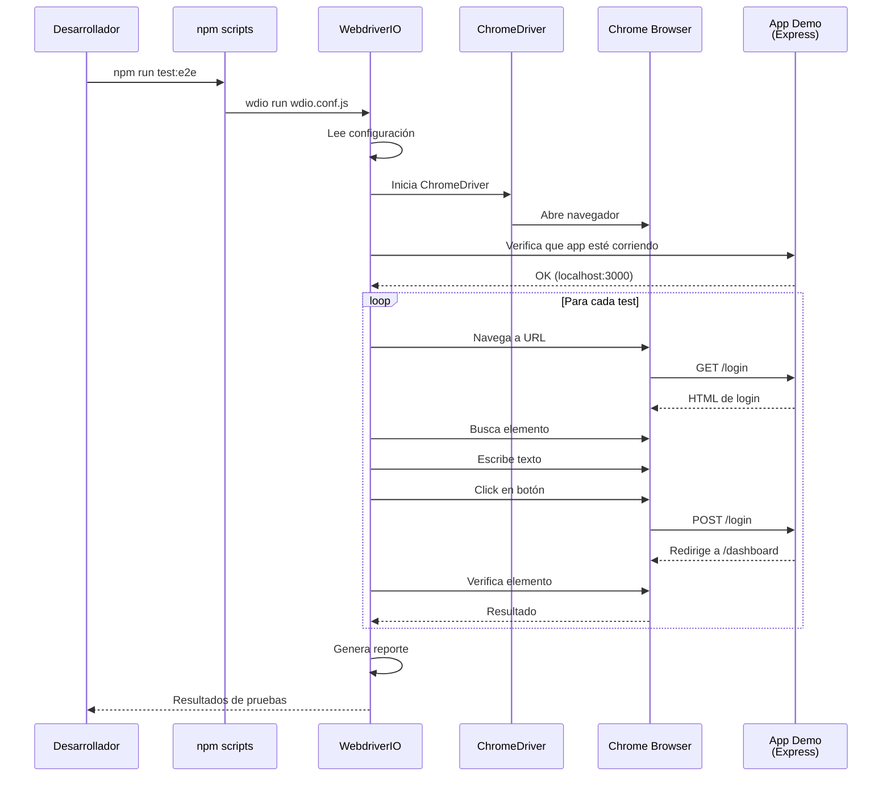
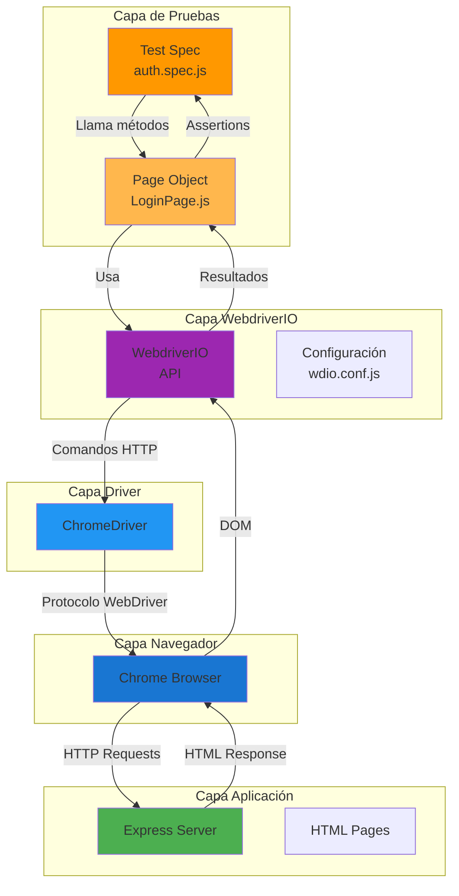
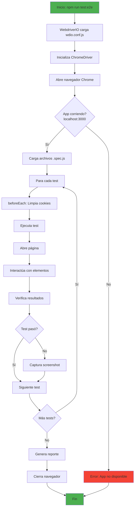
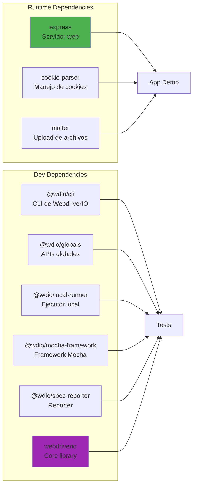

# Arquitectura del Proyecto

## Estructura de Directorios

## Componentes Principales

### 1. Aplicación Demo (`app/`)

**Propósito**: Proporcionar una aplicación web simple y determinística para probar todas las capacidades de Selenium.

**Páginas incluidas**:
- `index.html` - Página principal
- `login.html` - Autenticación
- `dashboard.html` - Panel después del login
- `table.html` - Tabla con filtros y ordenamiento
- `modal.html` - Modales y pop-ups
- `alerts.html` - Alertas del navegador
- `iframe.html` - Trabajo con iframes
- `dragdrop.html` - Drag and drop
- `upload.html` - Subida de archivos
- `windows.html` - Múltiples ventanas/tabs
- `dynamic.html` - Contenido dinámico

### 2. Suite de Pruebas (`tests/e2e/`)

**Estructura**:
- `specs/` - Archivos de prueba (`.spec.js`)
- `pageobjects/` - Clases que representan páginas
- `fixtures/` - Archivos de datos para pruebas

### 3. Configuración WebdriverIO (`wdio.conf.js`)

## Flujo de Datos

## Interacción entre Componentes

## Flujo de Ejecución de un Test

## Dependencias del Proyecto

## Ventajas de esta Arquitectura

1. **Separación de responsabilidades**: App demo separada de las pruebas
2. **Page Object Model**: Código reutilizable y mantenible
3. **Configuración centralizada**: Todo en `wdio.conf.js`
4. **Determinístico**: App demo controlada, sin dependencias externas
5. **Extensible**: Fácil agregar nuevas páginas y tests
