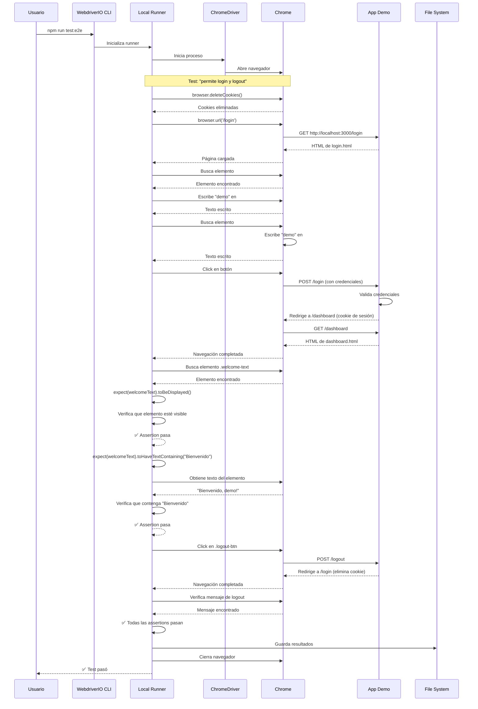
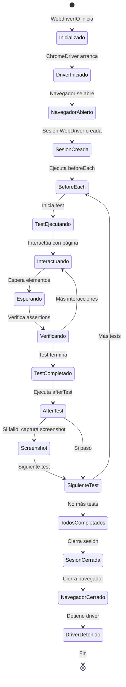
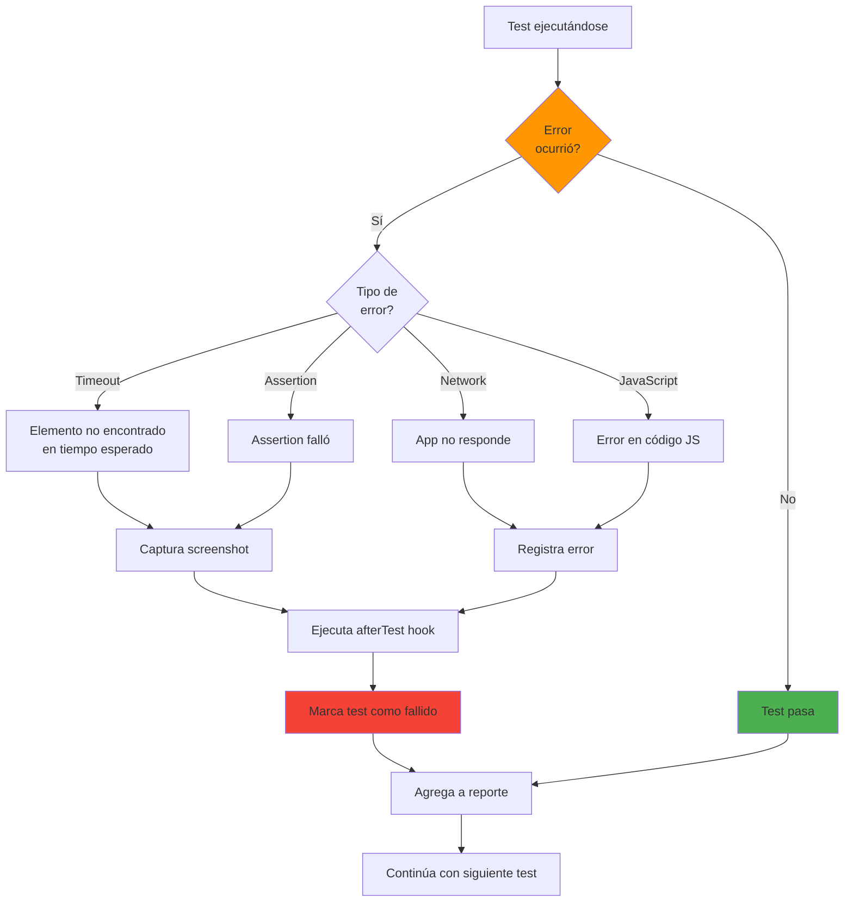
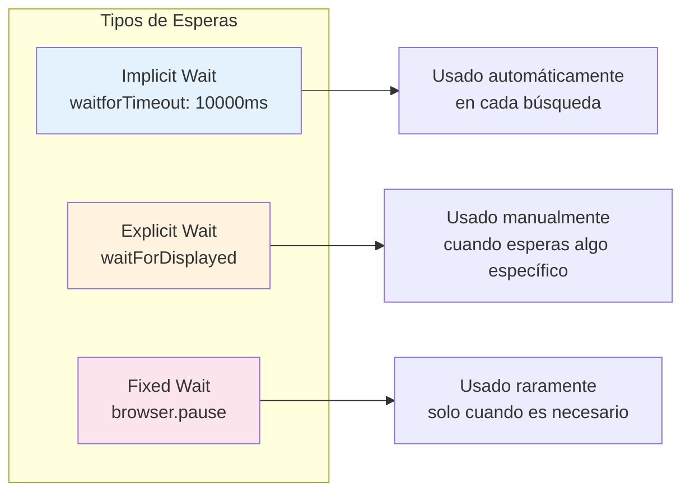
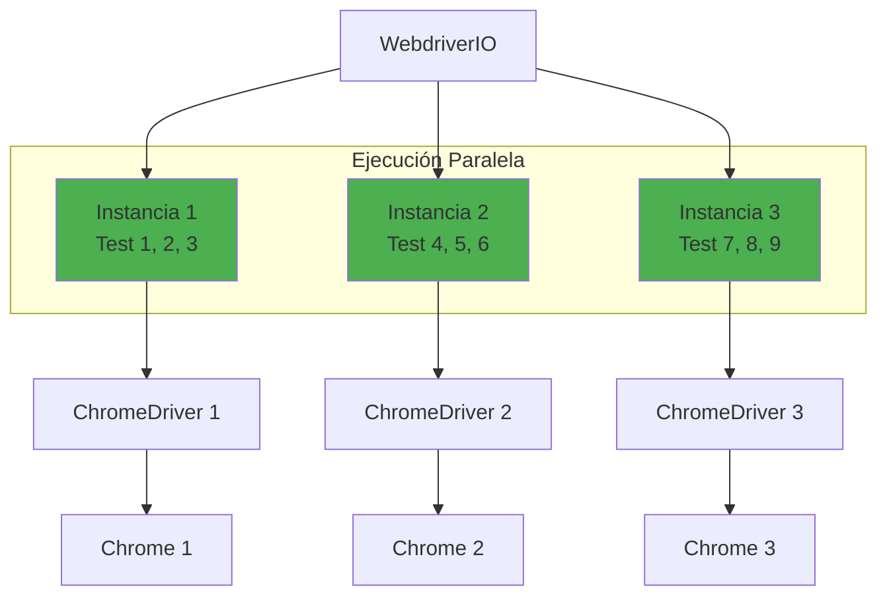

# Flujo de Ejecución Paso a Paso

## Visión General

Este documento explica detalladamente cómo se ejecuta una prueba desde que ejecutas el comando hasta que obtienes los resultados.

## Flujo Completo de Ejecución

```mermaid
flowchart TD
    Start[Usuario ejecuta:<br/>npm run test:e2e] --> ParseCmd[Shell parsea comando]
    ParseCmd --> NPM[NPM busca script en package.json]
    NPM --> FindScript{Encuentra<br/>test:e2e?}
    
    FindScript -->|No| Error1[Error: Script no encontrado]
    FindScript -->|Sí| Execute[Ejecuta: wdio run wdio.conf.js]
    
    Execute --> WDIO_CLI[WebdriverIO CLI inicia]
    WDIO_CLI --> LoadConfig[Carga wdio.conf.js]
    LoadConfig --> ParseConfig[Parsea configuración]
    
    ParseConfig --> InitRunner[Inicializa Local Runner]
    InitRunner --> CheckSpecs[Verifica archivos specs/**/*.spec.js]
    CheckSpecs --> SpecsFound{Archivos<br/>encontrados?}
    
    SpecsFound -->|No| Error2[Error: No se encontraron specs]
    SpecsFound -->|Sí| LoadFramework[Carga framework Mocha]
    
    LoadFramework --> InitDriver[Inicializa ChromeDriver]
    InitDriver --> DownloadDriver{ChromeDriver<br/>disponible?}
    
    DownloadDriver -->|No| AutoDownload[Descarga automática<br/>ChromeDriver compatible]
    DownloadDriver -->|Sí| StartDriver[Inicia proceso ChromeDriver]
    AutoDownload --> StartDriver
    
    StartDriver --> StartBrowser[Abre navegador Chrome]
    StartBrowser --> CheckApp[Verifica app en localhost:3000]
    CheckApp --> AppRunning{App<br/>respondiendo?}
    
    AppRunning -->|No| Error3[Error: App no disponible<br/>Ejecuta: npm start]
    AppRunning -->|Sí| CreateSession[Crea sesión WebDriver]
    
    CreateSession --> ForEachSpec[Para cada archivo .spec.js]
    ForEachSpec --> LoadSpec[Carga y parsea spec]
    LoadSpec --> ForEachTest[Para cada test en spec]
    
    ForEachTest --> BeforeEach[Ejecuta beforeEach hooks]
    BeforeEach --> ExecuteTest[Ejecuta test]
    
    ExecuteTest --> TestSteps[Ejecuta pasos del test]
    TestSteps --> AfterTest[Ejecuta afterTest hook]
    AfterTest --> ScreenshotCheck{Test<br/>falló?}
    
    ScreenshotCheck -->|Sí| TakeScreenshot[Captura screenshot<br/>en artifacts/screenshots/]
    ScreenshotCheck -->|No| NextTest[Siguiente test]
    TakeScreenshot --> NextTest
    
    NextTest --> MoreTests{Más tests<br/>en spec?}
    MoreTests -->|Sí| ForEachTest
    MoreTests -->|No| MoreSpecs{Más specs?}
    
    MoreSpecs -->|Sí| ForEachSpec
    MoreSpecs -->|No| GenerateReport[Genera reporte]
    
    GenerateReport --> CloseSession[Cierra sesión WebDriver]
    CloseSession --> StopDriver[Detiene ChromeDriver]
    StopDriver --> CloseBrowser[Cierra navegador]
    CloseBrowser --> End[Fin: Muestra resultados]
    
    Error1 --> End
    Error2 --> End
    Error3 --> End
    
    style Start fill:#4caf50
    style Error1 fill:#f44336
    style Error2 fill:#f44336
    error3 fill:#f44336
    style End fill:#4caf50
```

## Ejemplo Detallado: Test de Login

Vamos a seguir paso a paso cómo se ejecuta un test específico:



## Ciclo de Vida de un Test



## Comandos WebDriver en Acción

Cuando ejecutas un comando como `browser.click('#button')`, esto es lo que sucede:

```mermaid
graph TB
    Start[Test: browser.click('#button')] --> Step1[1. WebdriverIO busca elemento]
    Step1 --> Step2[2. Espera a que elemento esté visible<br/>waitForDisplayed]
    Step2 --> Step3[3. Convierte a comando HTTP]
    Step3 --> Step4[4. POST /session/{id}/element/{id}/click]
    Step4 --> Step5[5. ChromeDriver recibe request]
    Step5 --> Step6[6. ChromeDriver ejecuta acción nativa]
    Step6 --> Step7[7. Chrome ejecuta click en DOM]
    Step7 --> Step8[8. Chrome dispara eventos JS]
    Step8 --> Step9[9. Respuesta HTTP 200 OK]
    Step9 --> Step10[10. WebdriverIO resuelve Promise]
    Step10 --> End[Test continúa]
    
    style Start fill:#4caf50
    style End fill:#4caf50
```

## Manejo de Errores



## Tiempos y Esperas

WebdriverIO maneja diferentes tipos de esperas:



**Ejemplo de espera explícita**:
```javascript
// Espera hasta 10 segundos a que el elemento esté visible
await LoginPage.username.waitForDisplayed({ timeout: 10000 });
```

## Paralelización (Futuro)

Actualmente `maxInstances: 1`, pero se puede paralelizar:



## Resumen del Flujo

1. **Inicio**: Comando `npm run test:e2e`
2. **Configuración**: WebdriverIO carga `wdio.conf.js`
3. **Driver**: ChromeDriver se inicia automáticamente
4. **Navegador**: Chrome se abre
5. **Tests**: Cada test se ejecuta secuencialmente
6. **Interacción**: Comandos se envían al navegador vía protocolo WebDriver
7. **Verificación**: Assertions verifican resultados
8. **Reporte**: Resultados se muestran en consola
9. **Limpieza**: Navegador y driver se cierran
