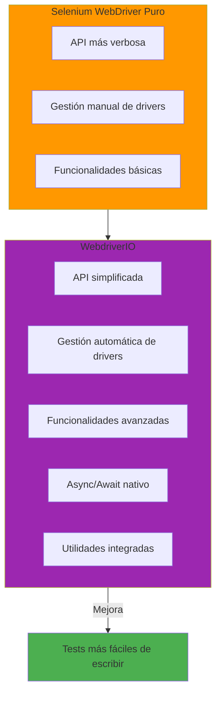
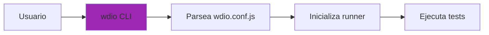
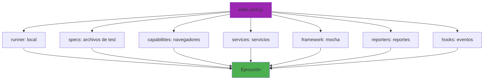
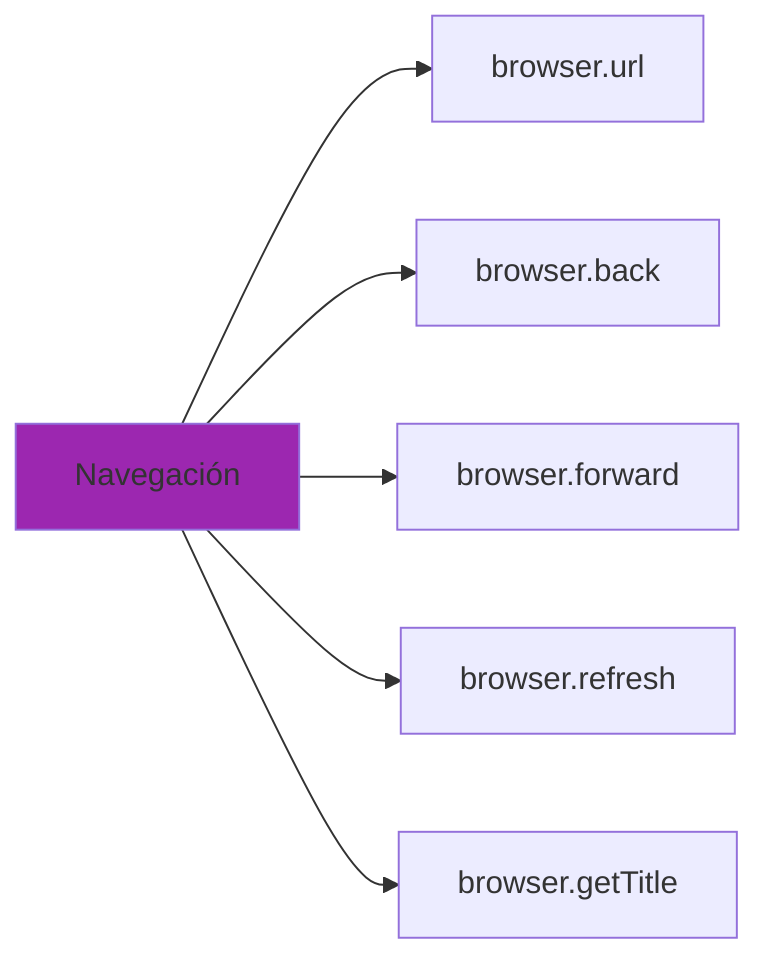
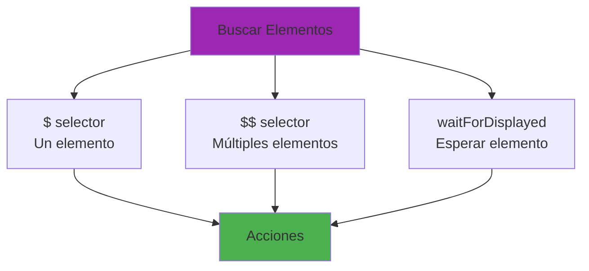
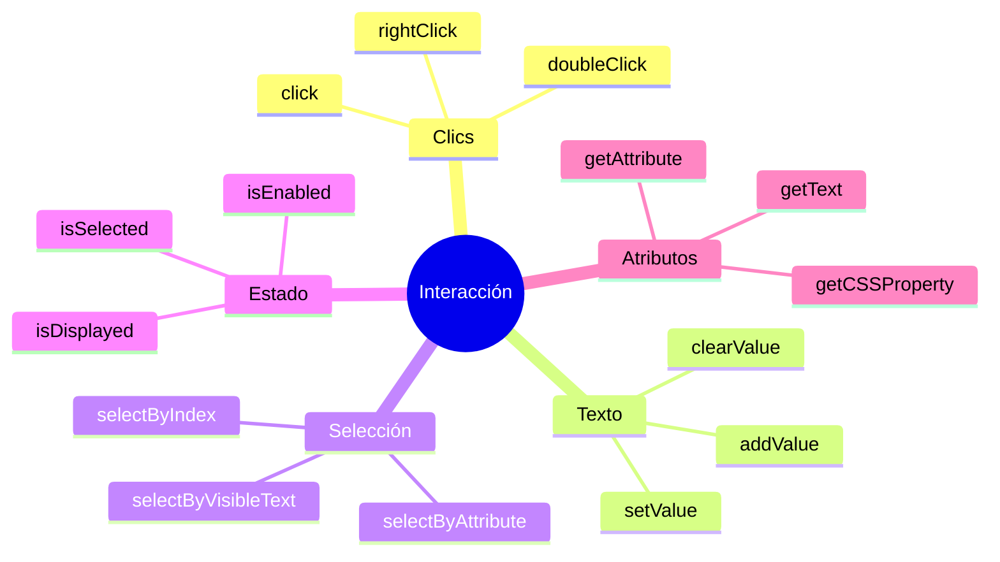
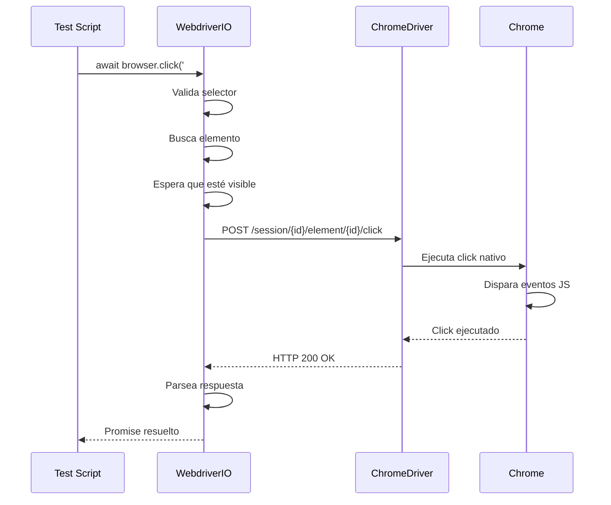
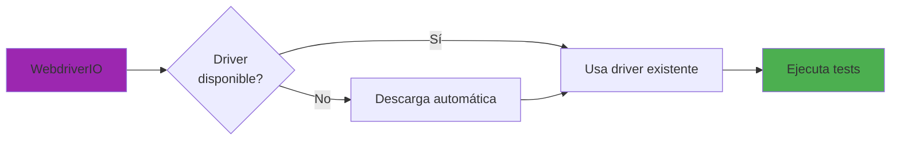
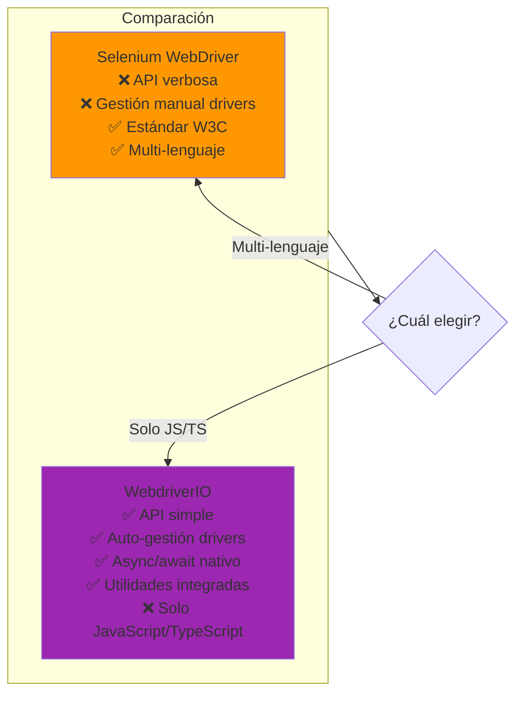
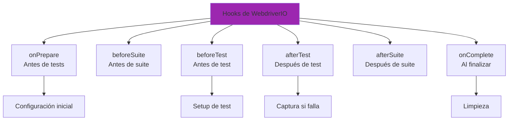

# WebdriverIO

## ¿Qué es WebdriverIO?

**WebdriverIO** es un framework de automatización de pruebas para Node.js que actúa como un wrapper mejorado sobre Selenium WebDriver. Proporciona una API más moderna, fácil de usar y con mejores características que Selenium puro.

## WebdriverIO vs Selenium WebDriver



## Arquitectura de WebdriverIO

```mermaid
graph TB
    subgraph TestLayer["Capa de Tests"]
        Specs[Test Specs<br/>.spec.js files]
        PageObjects[Page Objects]
    end
    
    subgraph WDIO["WebdriverIO Core"]
        CLI[CLI<br/>@wdio/cli]
        Runner[Runner<br/>@wdio/local-runner]
        Framework[Framework<br/>@wdio/mocha-framework]
        Reporter[Reporter<br/>@wdio/spec-reporter]
    end
    
    subgraph DriverLayer["Capa de Drivers"]
        ChromeDriver[ChromeDriver<br/>Auto-gestionado]
        GeckoDriver[GeckoDriver<br/>Auto-gestionado]
    end
    
    subgraph BrowserLayer["Navegadores"]
        Chrome[Chrome]
        Firefox[Firefox]
    end
    
    Specs --> CLI
    PageObjects --> CLI
    CLI --> Runner
    Runner --> Framework
    Framework --> Reporter
    Runner --> ChromeDriver
    Runner --> GeckoDriver
    ChromeDriver --> Chrome
    GeckoDriver --> Firefox
    
    style CLI fill:#9c27b0
    style Runner fill:#ba68c8
    style Framework fill:#ce93d8
    style Reporter fill:#e1bee7
```

## Componentes de WebdriverIO

### 1. @wdio/cli
Interfaz de línea de comandos para ejecutar pruebas.



### 2. @wdio/local-runner
Ejecutor local que gestiona la ejecución de pruebas en tu máquina.

### 3. @wdio/mocha-framework
Integración con Mocha para estructura de tests (describe, it, beforeEach, etc.).

### 4. @wdio/globals
Proporciona APIs globales como `browser`, `$`, `$$`, `expect`.

### 5. @wdio/spec-reporter
Reporter que muestra resultados en consola.

## Configuración (wdio.conf.js)



### Ejemplo de Configuración

```javascript
exports.config = {
  runner: "local",                    // Ejecutor local
  specs: ["./tests/**/*.spec.js"],    // Archivos de test
  capabilities: [{                    // Navegadores
    browserName: "chrome"
  }],
  services: [],                       // Servicios (vacío = auto)
  framework: "mocha",                 // Framework de testing
  reporters: ["spec"],                // Reporter
  baseUrl: "http://localhost:3000",   // URL base
  waitforTimeout: 10000,              // Timeout por defecto
};
```

## Comandos Principales de WebdriverIO

### Navegación



### Búsqueda de Elementos



### Interacción con Elementos



## Flujo de un Comando WebdriverIO



## Ventajas de WebdriverIO

### 1. API Simplificada

**Selenium puro**:
```javascript
const element = await driver.findElement(By.id('username'));
await element.sendKeys('demo');
await element.submit();
```

**WebdriverIO**:
```javascript
await $('#username').setValue('demo');
await $('#username').submit();
```

### 2. Gestión Automática de Drivers



### 3. Async/Await Nativo

WebdriverIO está diseñado desde cero para async/await, haciendo el código más limpio y legible.

### 4. Utilidades Integradas

- Screenshots automáticos
- Reportes visuales
- Integración con CI/CD
- Page Object Model simplificado

## Comparación: Selenium vs WebdriverIO



## Hooks y Eventos

WebdriverIO proporciona hooks para personalizar el comportamiento:



## En este Proyecto

Este proyecto utiliza WebdriverIO porque:

1. **API más simple**: Código más legible y fácil de mantener
2. **Gestión automática**: No necesitas instalar drivers manualmente
3. **Integración Mocha**: Estructura de tests familiar
4. **Utilidades**: Screenshots automáticos en fallos
5. **Comunidad activa**: Buen soporte y documentación

## Comandos Útiles

```bash
# Ejecutar todos los tests
npm run test:e2e

# Ejecutar en modo headless
npm run test:e2e:headless

# Ejecutar un spec específico
npx wdio run wdio.conf.js --spec tests/e2e/specs/auth.spec.js

# Ejecutar en modo interactivo
npx wdio run wdio.conf.js --watch
```

## Recursos Adicionales

- [Documentación oficial de WebdriverIO](https://webdriver.io/)
- [Guía de mejores prácticas](https://webdriver.io/docs/bestpractices)
- [API Reference](https://webdriver.io/docs/api)
