# Page Object Model (POM)

## ¿Qué es el Page Object Model?

El **Page Object Model (POM)** es un patrón de diseño que organiza el código de pruebas separando la lógica de interacción con la página web de los casos de prueba. Cada página web se representa como una clase.

## Concepto

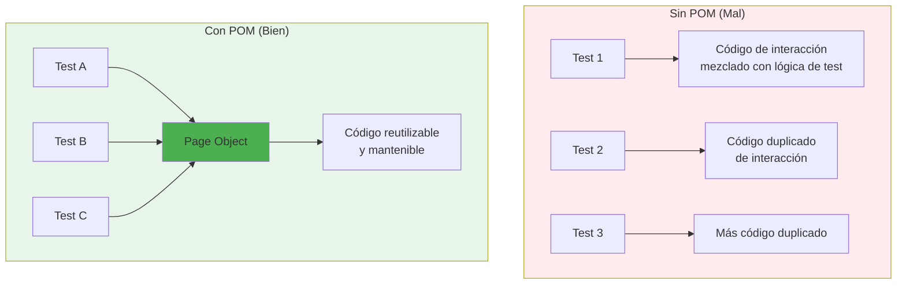

## Arquitectura POM en este Proyecto

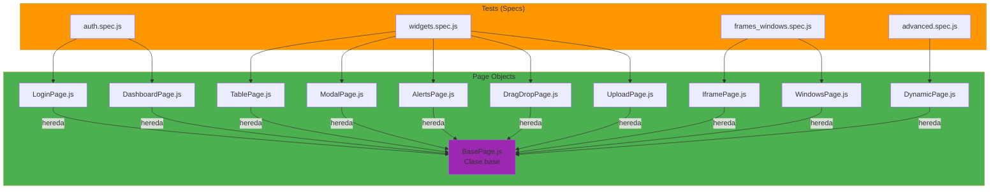

## Estructura de un Page Object

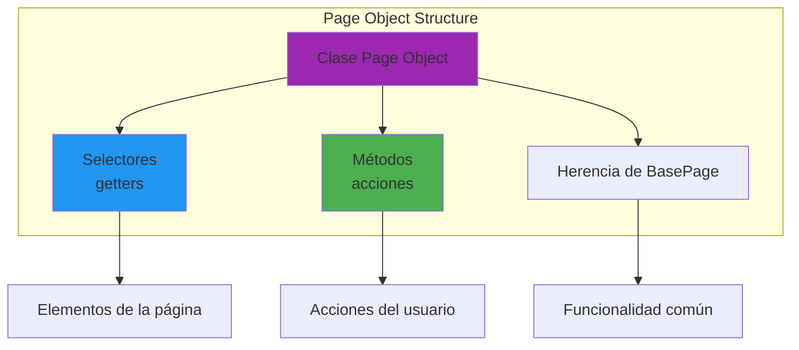

## Ejemplo: LoginPage

### Estructura

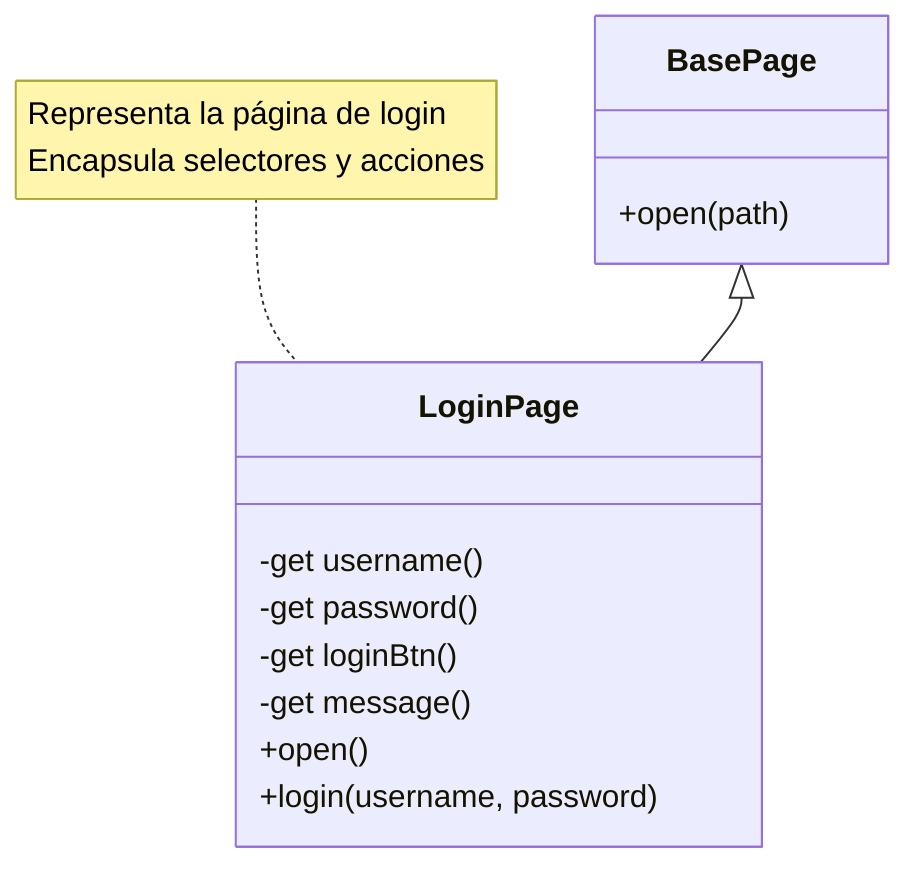

### Implementación

```javascript
class LoginPage extends BasePage {
  // Selectores como getters
  get username() {
    return $('#username');
  }
  
  get password() {
    return $('#password');
  }
  
  get loginBtn() {
    return $('#loginBtn');
  }
  
  get message() {
    return $('.message');
  }
  
  // Métodos de acción
  async open() {
    await super.open('/login');
  }
  
  async login(username, password) {
    await this.username.setValue(username);
    await this.password.setValue(password);
    await this.loginBtn.click();
  }
}
```

## Flujo de Uso

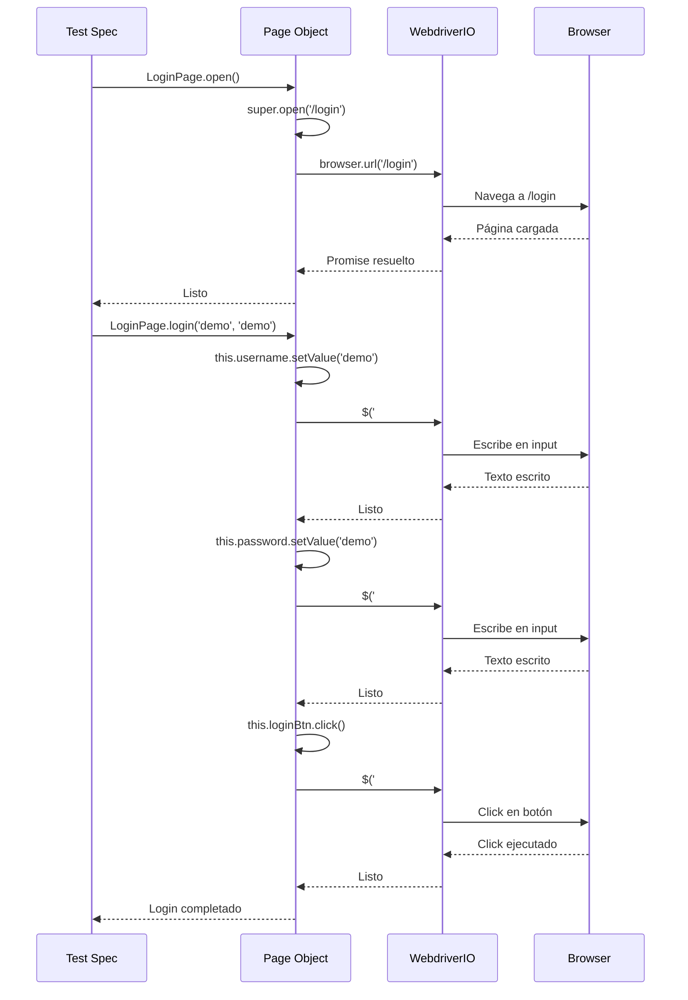

## Ventajas del POM

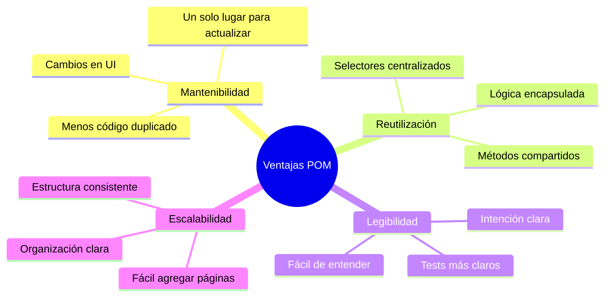

## BasePage: Funcionalidad Común

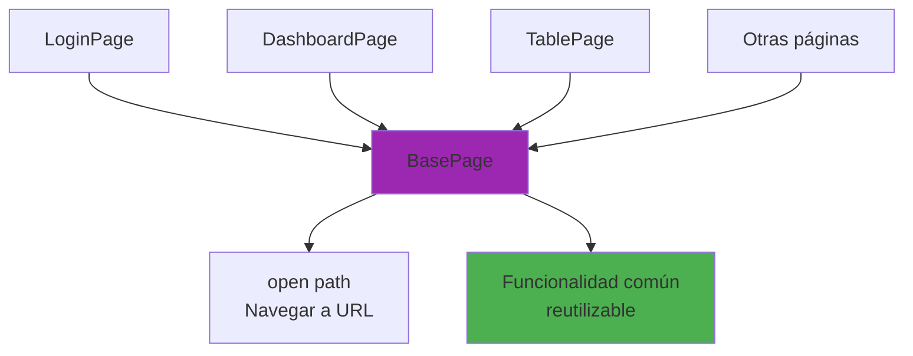

**BasePage.js**:
```javascript
class BasePage {
  open(path) {
    return browser.url(path);
  }
}
```

Todas las páginas heredan de `BasePage` para tener acceso a métodos comunes.

## Patrón de Selectores

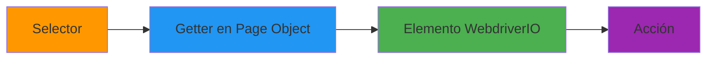

**Ventajas de usar getters**:
- Lazy evaluation: El elemento se busca solo cuando se usa
- Reutilizable: Se puede usar múltiples veces
- Mantenible: Cambio en un solo lugar

## Ejemplo Completo: Test con POM

### Sin POM (Mal)

```javascript
describe('Login', () => {
  it('should login', async () => {
    await browser.url('/login');
    await $('#username').setValue('demo');
    await $('#password').setValue('demo');
    await $('#loginBtn').click();
    await expect($('.welcome')).toBeDisplayed();
  });
});
```

**Problemas**:
- Selectores duplicados en múltiples tests
- Si cambia el selector, hay que actualizar todos los tests
- Difícil de mantener

### Con POM (Bien)

```javascript
const LoginPage = require('../pageobjects/LoginPage');
const DashboardPage = require('../pageobjects/DashboardPage');

describe('Login', () => {
  it('should login', async () => {
    await LoginPage.open();
    await LoginPage.login('demo', 'demo');
    await expect(DashboardPage.welcomeText).toBeDisplayed();
  });
});
```

**Ventajas**:
- Código más legible
- Selectores centralizados
- Fácil de mantener
- Reutilizable

## Relación entre Tests y Page Objects

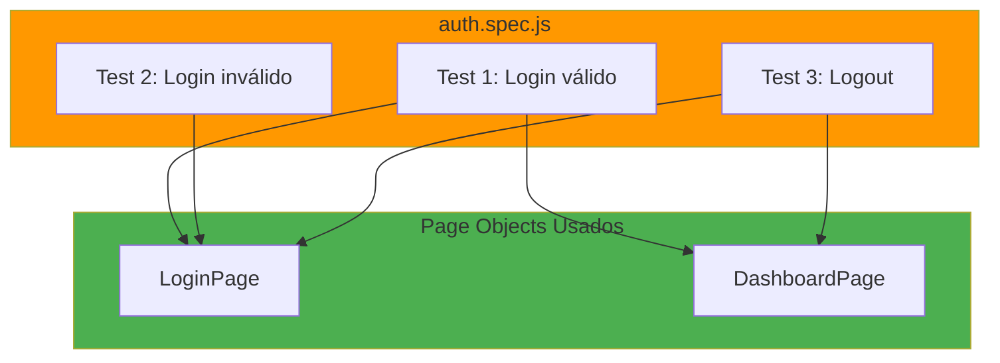

## Mejores Prácticas

### 1. Un Page Object por Página

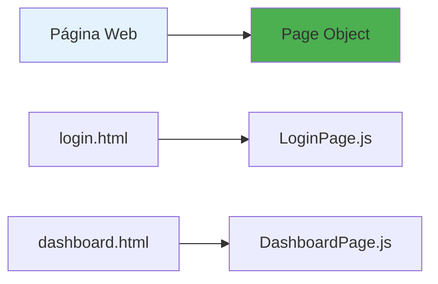

### 2. Métodos que Representan Acciones del Usuario

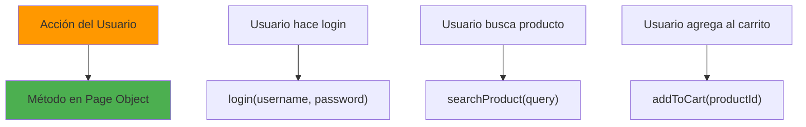

### 3. Selectores como Getters

```javascript
// ✅ Bien
get username() {
  return $('#username');
}

// ❌ Mal (no usar propiedades directas)
username = $('#username');
```

### 4. No Incluir Assertions en Page Objects

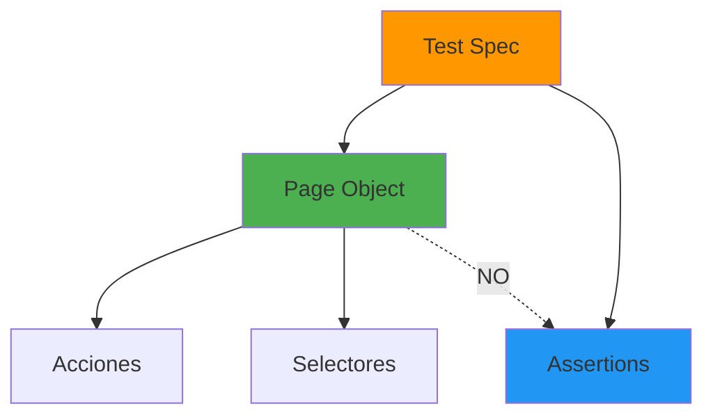

**Razón**: Los Page Objects deben ser agnósticos a las verificaciones. Las assertions pertenecen a los tests.

## Resumen

El Page Object Model en este proyecto:

1. **Organiza el código**: Cada página tiene su clase
2. **Facilita mantenimiento**: Cambios en UI se hacen en un solo lugar
3. **Mejora legibilidad**: Tests más claros y expresivos
4. **Promueve reutilización**: Métodos compartidos entre tests
5. **Escalable**: Fácil agregar nuevas páginas y tests
