# Casos de Prueba

## Tipos de Pruebas Implementadas

Este proyecto incluye una suite completa de pruebas que demuestran las capacidades principales de Selenium/WebdriverIO.

## Mapa de Pruebas

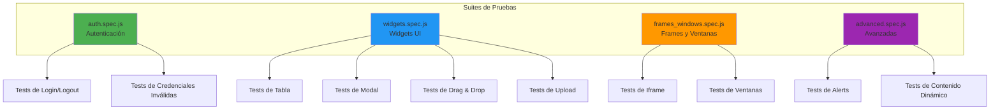

## 1. Autenticación (auth.spec.js)

### Casos de Prueba

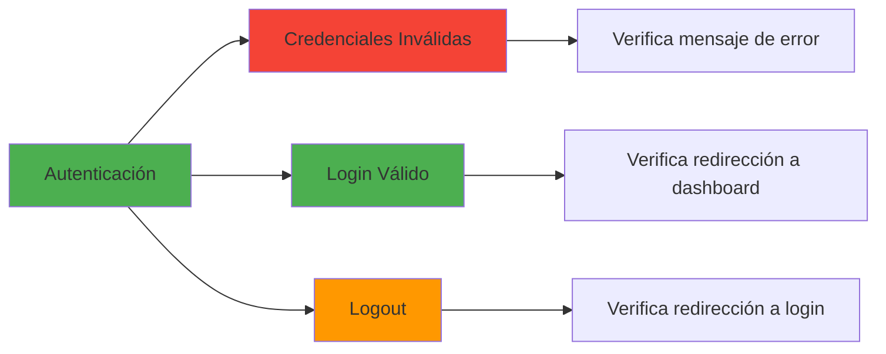

### Flujo de Prueba: Login Válido

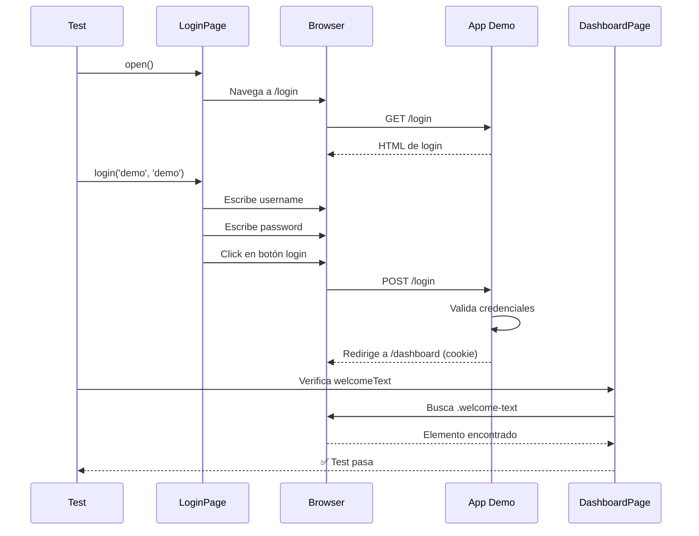

### Tests Incluidos

1. **Muestra error con credenciales inválidas**
   - Intenta login con credenciales incorrectas
   - Verifica que se muestra mensaje de error

2. **Permite login y logout**
   - Login con credenciales válidas
   - Verifica redirección a dashboard
   - Ejecuta logout
   - Verifica redirección a login

## 2. Widgets UI (widgets.spec.js)

### Tabla con Filtros y Ordenamiento

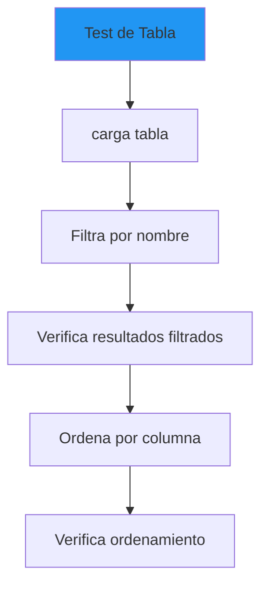

**Capacidades demostradas**:
- Búsqueda de elementos en tabla
- Interacción con inputs de filtro
- Verificación de contenido de celdas
- Ordenamiento de datos

### Modal

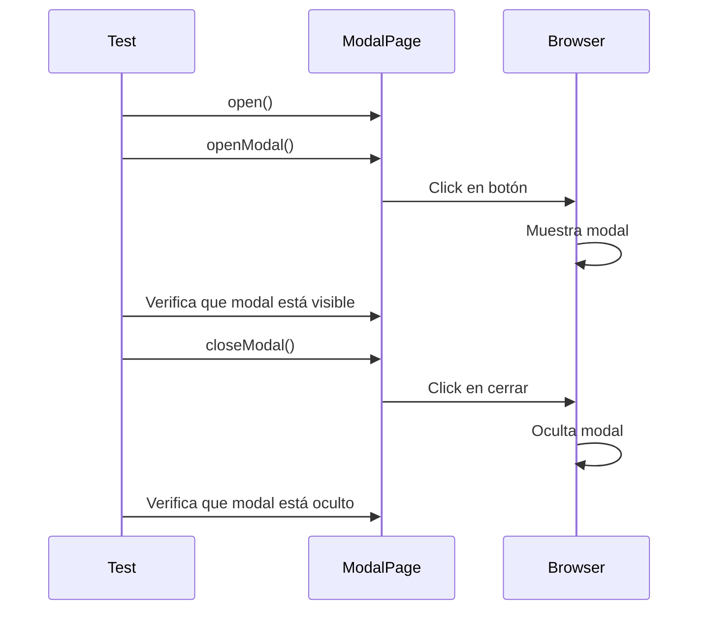

**Capacidades demostradas**:
- Interacción con modales
- Verificación de visibilidad
- Cierre de modales

### Drag & Drop

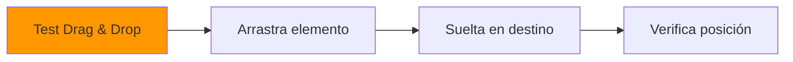

**Capacidades demostradas**:
- Drag and drop nativo
- Verificación de posición final
- Interacción con elementos arrastrables

### Upload de Archivos

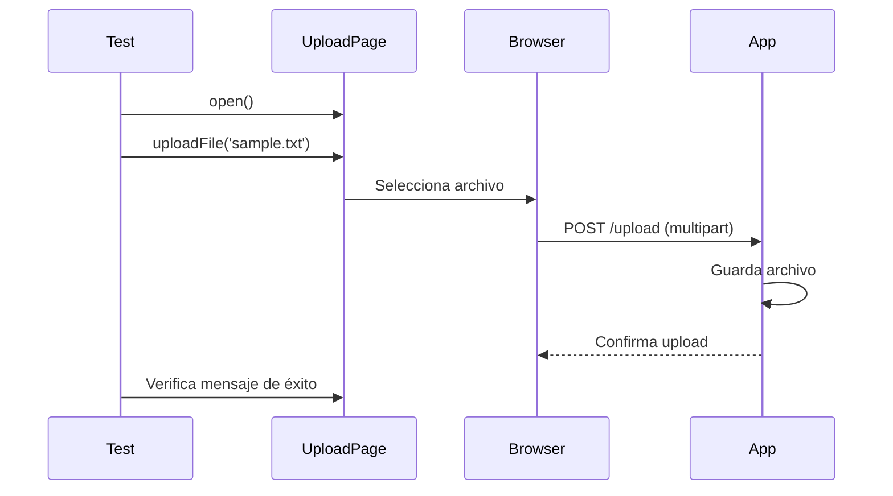

**Capacidades demostradas**:
- Subida de archivos
- Manejo de input type="file"
- Verificación de upload exitoso

## 3. Frames y Ventanas (frames_windows.spec.js)

### Iframe

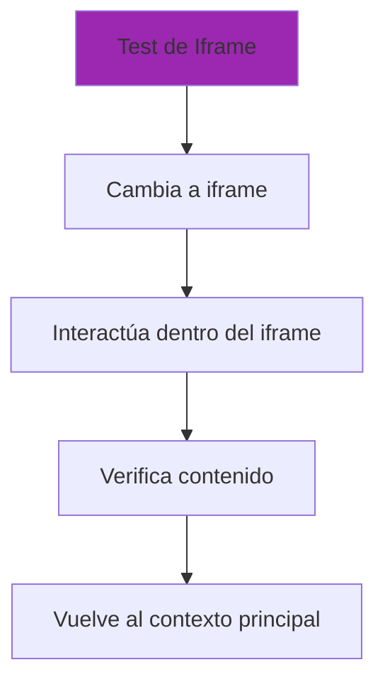

**Flujo detallado**:

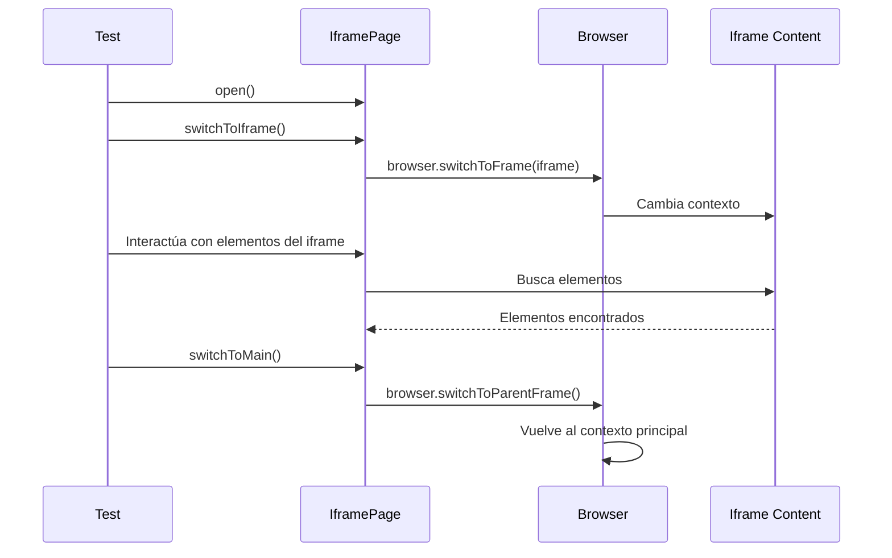

**Capacidades demostradas**:
- Cambio de contexto a iframe
- Interacción dentro de iframe
- Regreso al contexto principal

### Múltiples Ventanas

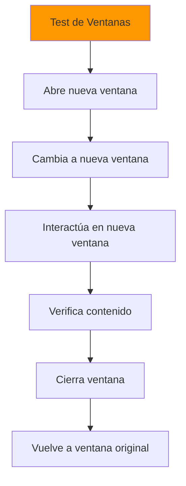

**Capacidades demostradas**:
- Manejo de múltiples ventanas/tabs
- Cambio entre ventanas
- Cierre de ventanas
- Verificación en diferentes ventanas

## 4. Pruebas Avanzadas (advanced.spec.js)

### Alerts del Navegador

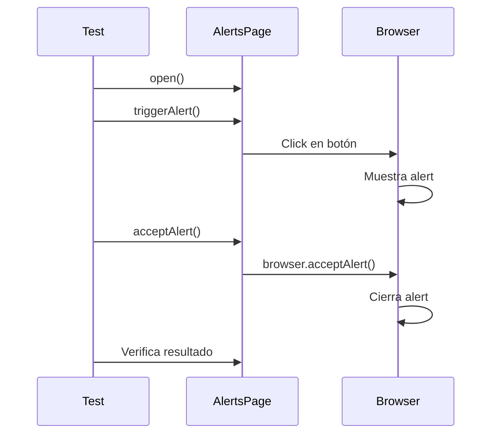

**Tipos de alerts probados**:
- Alert simple (OK)
- Confirm (OK/Cancel)
- Prompt (con input)

**Capacidades demostradas**:
- Manejo de alertas nativas del navegador
- Aceptar/rechazar alerts
- Escribir en prompts

### Contenido Dinámico

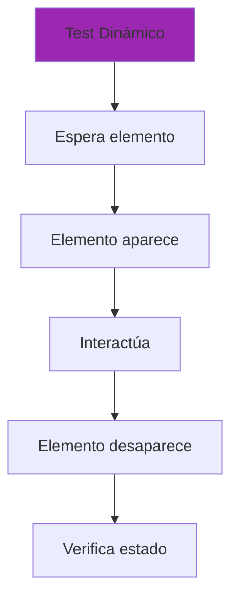

**Capacidades demostradas**:
- Esperas explícitas (waitForDisplayed)
- Manejo de contenido que aparece/desaparece
- Verificación de estados dinámicos

## Cobertura de Capacidades de Selenium

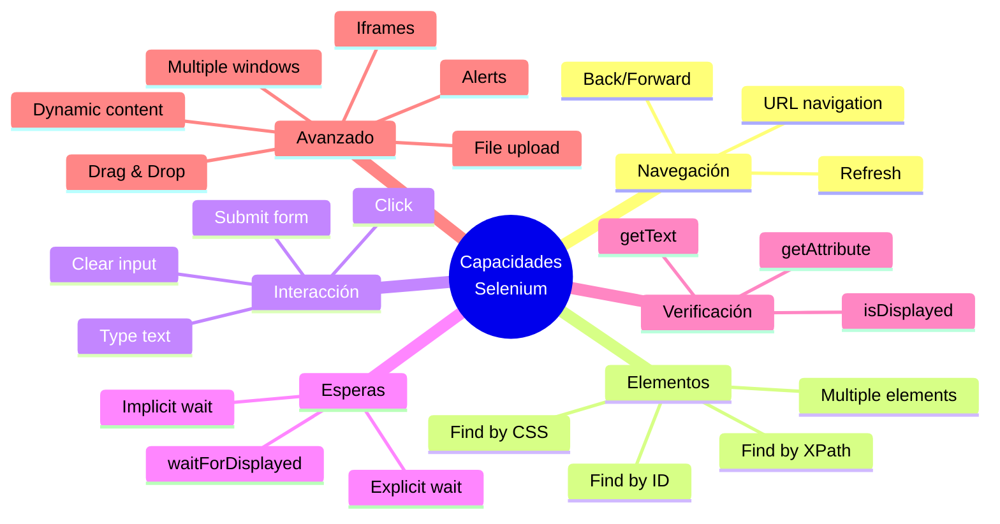

## Estructura de Archivos de Prueba

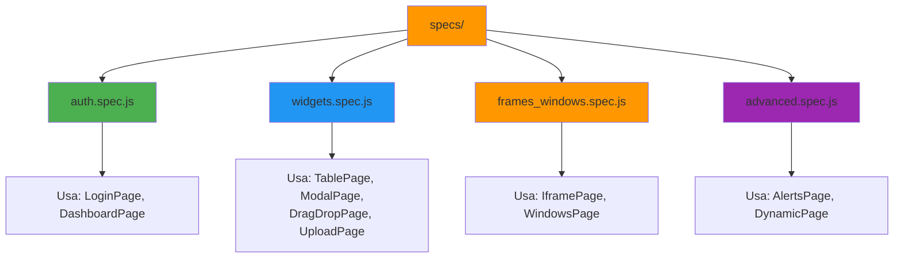

## Ejecución de Pruebas

### Orden de Ejecución

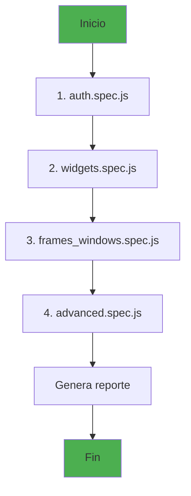

### Resultados Esperados

Cada suite de pruebas verifica:
- ✅ Funcionalidad correcta
- ✅ Manejo de errores
- ✅ Estados de UI
- ✅ Interacciones complejas

## Resumen

Este proyecto demuestra:

1. **Autenticación**: Login, logout, manejo de sesiones
2. **Widgets**: Tablas, modales, drag & drop, uploads
3. **Frames/Ventanas**: Iframes, múltiples ventanas
4. **Avanzado**: Alerts, contenido dinámico

**Total**: Más de 15 casos de prueba que cubren las capacidades principales de Selenium/WebdriverIO.
